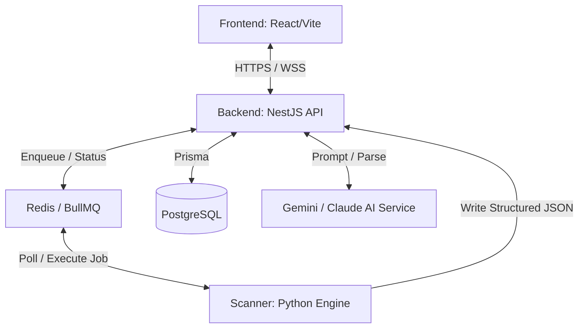

# CipherLens — Master AI Development Guide (AGENTS.md)

Welcome to the official developer and AI knowledge base for **CipherLens**. This document acts as the single source of truth for the project's architecture, design philosophy, coding standards, development workflows, and behavioral rules for all AI agents (e.g., Gemini, Claude) and human developers.

---

## 1. Project Overview & Vision

**CipherLens** is an enterprise-grade, AI-powered defensive security auditing platform. It is designed to run automated security assessments against websites and source code repositories. 

> [!IMPORTANT]
> **Defensive Alignment:** CipherLens is strictly a defensive auditing tool. It is **NOT** an offensive security platform. It performs non-destructive scans, analysis of infrastructure configurations, dependency auditing, and provides AI-assisted explanations and remediation guidelines.

### MVP Scope (Primary Goal)
The MVP focus is strictly limited to:
* **Website Security Audits:** Checking headers, SSL/TLS configurations, exposed endpoints, and basic configuration issues.
* **Git Repository Security Audits:** Checking for hardcoded secrets, misconfigurations, known vulnerable dependencies, and repository hygiene.
* **AI-Generated Security Reports:** Structuring scan data and using LLMs to prioritize findings, write technical summaries, and explain remediation.
* **Dashboard:** A unified web console to trigger audits, view active/past scans, and review security postures.
* **Scan History:** Audit trail of all previous assessments with historical diffing.
* **Project Management:** Organizing targets, schedules, and reports by projects/organizations.

---

## 2. Technology Stack

### Frontend
* **Core:** React 18+ (TypeScript), Vite (Build tool)
* **Styling:** Tailwind CSS, Framer Motion (Animations), [shadcn/ui](https://ui.shadcn.com/) (Component primitive baseline)
* **Routing:** React Router v6
* **State Management & Data Fetching:** Zustand (Global UI state), TanStack Query v5 (Server state caching)

### Backend
* **Core:** NestJS (TypeScript), Prisma ORM
* **Database:** PostgreSQL (Primary transactional store), Redis (Queue state, cache, rate-limiting)
* **Task Queue:** BullMQ (Distributed job queue for scheduling and orchestrating scans)
* **Documentation:** OpenAPI / Swagger (Auto-generated from NestJS controllers)

### Scanner Engine
* **Core:** Python 3.11+
* **Capabilities:** Secret scanning, dependency checking, web header parsing, vulnerability analysis.
* **Output:** Strictly structured JSON schemas.

### Infrastructure
* **Containerization:** Docker & Docker Compose
* **Orchestration (Future-Ready):** Design patterns must support seamless transition to Kubernetes (e.g., stateless containers, externalized configs, cloud storage, horizontal scaling ready).

---

## 3. Clean Architecture Rules

CipherLens enforces strict separation of concerns. The code is split into three main modules: `frontend`, `backend`, and `scanner`.



### Module Boundaries
1. **Frontend:**
   * Communicates *only* with the NestJS backend API.
   * **Never** communicates directly with the Python scanners.
   * State and API integration must be managed via TanStack Query and Zustand.

2. **Backend:**
   * Acts as the orchestrator.
   * Handles authentication (JWT/OAuth), user authorization, project management, queue management via BullMQ, DB persistence, and AI reporting.
   * **Never** performs CPU-heavy security scanning logic directly in the API process.

3. **Scanner:**
   * Execute task-specific security checks.
   * Must be completely decoupled from the web application state.
   * **Never** write to the primary application database.
   * Must consume jobs, execute scans, and return structured JSON schemas back to the orchestrator or write them to object storage.

4. **AI Orchestration:**
   * Responsible for: explaining findings, prioritizing risks based on context, generating executive summaries, and drafting remediation code snippets.
   * **Never** invent or hallucinate vulnerabilities. It must only analyze and elaborate on scanner-provided evidence.

---

## 4. Directory & Folder Structure

The repository root is organized as follows:

```
CipherLens/
├── .github/                 # CI/CD Workflows, issue templates
├── backend/                 # NestJS application
├── docs/                    # Centralized markdown documentation
│   ├── architecture/        # High-level design diagrams and descriptions
│   ├── roadmap/             # Roadmap milestones
│   ├── development/         # Developer guides, environments
│   ├── security/            # Security policies and secure coding guidelines
│   ├── product/             # PRDs and user experience flows
│   ├── tasks/               # Backlog, active, and completed task lists
│   ├── decisions/           # Architecture Decision Records (ADRs)
│   └── changelog/           # Change logs and release notes
├── frontend/                # React / Vite application
├── infrastructure/          # Dockerfiles, Compose scripts, Helm charts
├── scanner/                 # Python scanners and security tools
├── scripts/                 # Utility and developer automation scripts
├── AGENTS.md                # Master AI Guidance File (this file)
├── CLAUDE.md                # Claude-specific overrides and instructions
├── GEMINI.md                # Gemini-specific overrides and instructions
└── README.md                # General introduction and project bootstrap guide
```

---

## 5. Development Workflow & "Documentation First"

We practice a strict **Documentation First** philosophy. Documentation is treated with the same rigor as production code.

### The Lifecycle of a Feature
1. **Design & Document:**
   * Draft user-facing documentation, API specs (OpenAPI), or system architecture changes *before* writing code.
   * For major architectural modifications, write an **Architecture Decision Record (ADR)** in `docs/decisions/`.
2. **Task Registration:**
   * Create tasks in `docs/tasks/backlog.md`. Move them to `docs/tasks/active_tasks.md` when execution starts.
3. **Implementation:**
   * Write tests (TDD is highly encouraged).
   * Write clean, modular, typed code adhering to the styling and linting standards.
4. **Verification & Update:**
   * Verify implementation matches documentation.
   * Update the changelog (`docs/changelog/changelog.md`).
   * Mark tasks as completed in `docs/tasks/completed_tasks.md`.

> [!WARNING]
> No pull request will be merged if the documentation is outdated. Outdated docs are considered a build failure.

---

## 6. Coding & Engineering Standards

### General Standards
* **SOLID Principles:** Adhere strictly to Single Responsibility, Open/Closed, Liskov Substitution, Interface Segregation, and Dependency Inversion.
* **Separation of Concerns:** Keep business logic independent of frameworks and database systems.
* **DRY & KISS:** Keep it simple and reusable. Refactor duplicate patterns.

### TypeScript (Frontend & Backend)
* **Strict Typing:** `noImplicitAny: true` and strict null checking must be enabled. Do not use the `any` type unless absolutely necessary, in which case it must be accompanied by an explanatory comment or cast.
* **Modular Code:** Avoid massive files. Break logic into custom hooks, utility functions, or dedicated NestJS providers.
* **Dependency Injection:** Leverage NestJS's native DI container. Keep controllers thin; delegate logic to services.

### Python (Scanner Engine)
* **Type Hints:** All python code must use type annotations (`typing` module / PEP 484).
* **Code Formatting:** Adhere to PEP 8 standards. Use `black` for formatting and `mypy` for static type checking.
* **JSON Output:** Every scanner must define its JSON output schema utilizing `pydantic`.

### Styling & UI Standards (Frontend)
* Follow the [shadcn/ui design principles](https://ui.shadcn.com/).
* Use clean CSS custom properties (variables) for theme management (light/dark mode).
* Keep layout responsive (Mobile-first tailwind breakpoints).
* Implement high-quality transition animations using `framer-motion`.

---

## 7. Security Principles

As a security auditing tool, CipherLens must set the highest standard of security.

1. **Least Privilege:** Services, containers, and database users must operate with the absolute minimum access required.
2. **Defense in Depth:** Multiple layers of security checks (e.g., network segmentation, API token validation, database access control).
3. **Zero Trust:** Validate and sanitize every input from the frontend, scanners, and external APIs. Never assume a scan result payload is safe.
4. **Secure by Default:** All default settings must be configured securely (e.g., cookies, CORS policies, security headers).
5. **Principle of Separation:** Keep scanner processes strictly isolated from database connections.
6. **Immutable Scan Results:** Once a scan result is finalized, its database record must be immutable (no updates allowed to the results data).
7. **No Destructive Scanning:** Scanners must only read configurations and perform non-intrusive tests. Do not execute stress tests, heavy SQL injection payloads, or DDoS-like actions.
8. **Audit Transparency:** Maintain audit logs of all actions performed by users and background systems.
9. **Evidence Preservation:** Save exact network payloads, file content fragments, or dependency tree dumps that triggered a security finding. Do not just report the vulnerability; save the proof.

---

## 8. Testing expectations

All code must include automated testing suites:
* **Frontend:** Unit and component tests using Vitest and React Testing Library.
* **Backend:** Unit tests for services and E2E API tests via Supertest and Jest.
* **Scanner:** Integration tests using mock targets to verify JSON schema responses.
* **Verification:** Use the `verification-before-completion` skill check before marking any task as complete.

---

## 9. AI Behavior Rules & Guidelines

When working as an AI developer on CipherLens, you must:
1. **Never Hallucinate:** If you don't know an API contract or framework syntax, check it or search the web. Do not make up mock library properties.
2. **Write Absolute File Links:** When referring to code files or markdown files, always generate clickable markdown links using the absolute file URI scheme (e.g., `[filename](file:///home/eisen/projects/random-proj/CipherLens/docs/roadmap/roadmap.md)`).
3. **Check Guidelines:** Read the `GEMINI.md` or `CLAUDE.md` overrides depending on the context you are running in.
4. **Follow the ADR Process:** If a change alters standard architecture, stop and document the choice first.

---

## 10. Definition of Done (DoD)

A task or feature is only complete when:
- [ ] Code compiles without errors or warnings.
- [ ] TypeScript/Python typing is 100% complete and clean.
- [ ] All tests pass.
- [ ] Documentation (`docs/`) is updated to reflect all changes.
- [ ] The Changelog (`docs/changelog/changelog.md`) is updated.
- [ ] The task list is updated in `docs/tasks/`.
- [ ] Verify using workspace-specific validation steps.
