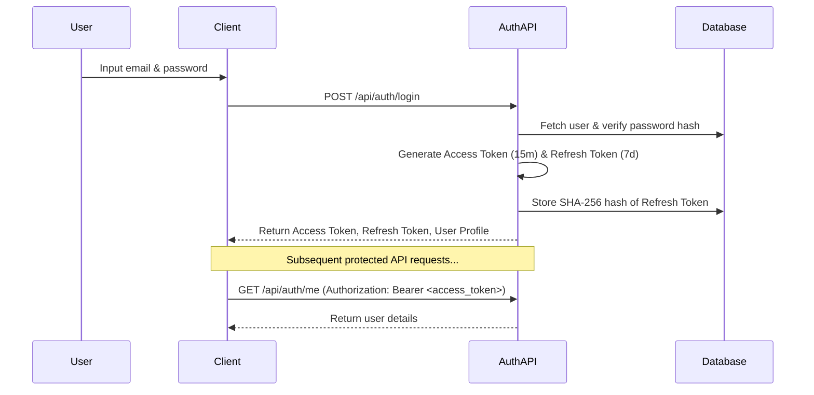

# CipherLens Authentication Specification (AUTH.md)

This document describes the authentication system, password hashing standards, JWT token lifecycle, security guard details, and future authentication expansion plans for **CipherLens**.

---

## 1. Authentication Overview

CipherLens implements a standard secure, stateless authentication mechanism utilizing JWT (JSON Web Tokens) with a short-lived Access Token and a long-lived, securely hashed Refresh Token stored in a database (`refresh_tokens` table).

*   **Version:** 1.0 (MVP)
*   **Protocol:** JWT Bearer Authentication
*   **Password Hashing:** bcrypt (12 rounds)
*   **Session State:** Stateless access, database-tracked refresh rotation

---

## 2. Password Security & Hashing

We enforce the following password security policies:
1.  **Complexity**: Minimum 8 characters.
2.  **Plaintext Protection**: Plaintext passwords are never logged, stored, or exposed.
3.  **Hashing Protocol**: Passwords are encrypted before database insertion using `bcrypt` via [`password.ts`](file:///home/eisen/projects/random-proj/CipherLens/backend/src/utils/password.ts).
4.  **Salt Rounds**: Configured via `.env` parameter `BCRYPT_ROUNDS` (defaulting to `12`).
5.  **Validation**: Performed securely using Zod validation schemas prior to hashing.

---

## 3. JWT Token Lifecycle

We implement a dual-token system to balance security with user experience:

### 3.1 Access Token
*   **Lifetime**: 15 minutes.
*   **Secret Key**: Mapped to `.env` parameter `JWT_ACCESS_SECRET`.
*   **Payload**: Contains `userId`, `email`, and a unique `jti` (JWT ID) to guarantee cryptographic signature uniqueness across requests.
*   **Transmission**: Passed via the `Authorization: Bearer <token>` header on protected requests.

### 3.2 Refresh Token
*   **Lifetime**: 7 days.
*   **Secret Key**: Mapped to `.env` parameter `JWT_REFRESH_SECRET`.
*   **Storage**: Stored in the database as a SHA-256 hash (`tokenHash`) to protect sessions against database leaks.
*   **Lifecycle Rotation**: On every `/api/auth/refresh` request, a new access token AND a rotated refresh token are generated. The old refresh token is revoked (deleted), preventing token reuse attacks.

---

## 4. Endpoints & Route Protection

All protected routes are guarded using [`AuthGuard`](file:///home/eisen/projects/random-proj/CipherLens/backend/src/middleware/auth.middleware.ts), which implements the following authorization flow:
1.  Extracts the bearer token from the HTTP headers.
2.  Verifies the access token using `verifyAccessToken` in [`jwt.ts`](file:///home/eisen/projects/random-proj/CipherLens/backend/src/utils/jwt.ts).
3.  Fetches the user profile from the database, ensuring the user exists and `isActive` is `true`.
4.  Attaches the user metadata to the request context (`req.user`) for controller access.

---

## 5. Future OAuth Integration Plan

To expand to Google, GitHub, or Microsoft authentication in Phase 2:
1.  **Schema Support**: Add an `oauth_accounts` table linking provider identifiers to `users.id`.
2.  **Stateless Registration**: If a user signs in via GitHub, search the `oauth_accounts` table. If found, issue JWT access/refresh tokens. If not, automatically provision a new user profile and link the OAuth account.
3.  **Passwordless Accounts**: Users registered via OAuth will have their `passwordHash` set to a random secure string (or remain nullable if supported), preventing raw password logins until a password reset is explicitly triggered.
