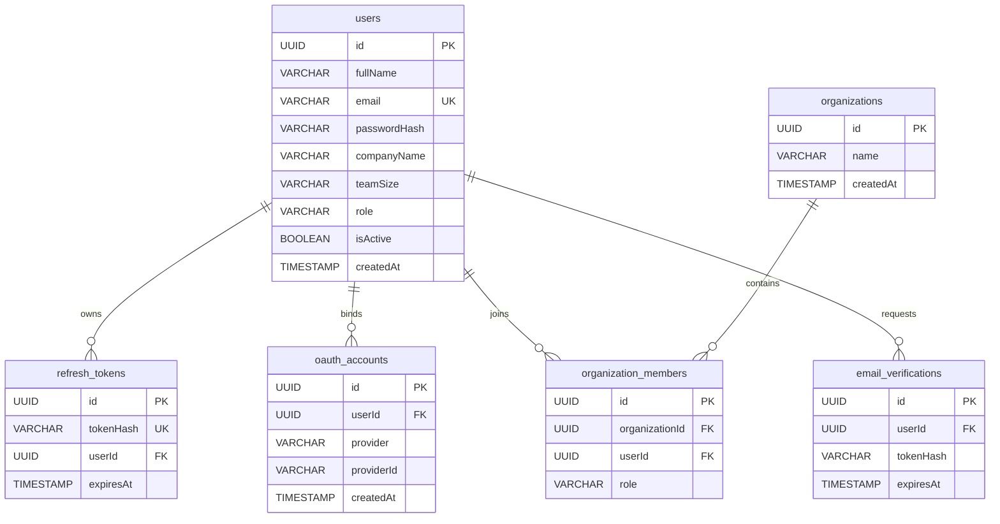

# CipherLens Database Specification (DATABASE.md)

This document provides a detailed overview of the database schema, Prisma configuration, indexing strategies, and future compatibility paths for **CipherLens**.

---

## 1. Database Overview

*   **Database Engine:** PostgreSQL (v15+)
*   **ORM:** Prisma
*   **Primary Key Strategy:** UUID v4 (string mapped to UUID in Postgres)
*   **Database URL Configuration:** Defined in `.env` as `DATABASE_URL`

---

## 2. Active Schema Models

The current database schema is declared in [`schema.prisma`](file:///home/eisen/projects/random-proj/CipherLens/backend/prisma/schema.prisma) and maps to the transactional database.

### 2.1 User Model (`users` table)
Stores user credentials, profile settings, and account metadata.

| Field Name | Prisma Type | DB Type | Constraints | Description |
| :--- | :--- | :--- | :--- | :--- |
| `id` | `String` | `UUID` | `PRIMARY KEY`, `DEFAULT(uuid())` | Unique ID of the user |
| `fullName` | `String` | `VARCHAR` | `NOT NULL` | Full Name of the user |
| `email` | `String` | `VARCHAR` | `NOT NULL`, `UNIQUE` | User email address (lowercased on entry) |
| `passwordHash`| `String` | `VARCHAR` | `NOT NULL` | Bcrypt password hash |
| `companyName` | `String?` | `VARCHAR` | `NULLABLE` | User company name (optional) |
| `teamSize` | `String?` | `VARCHAR` | `NULLABLE` | Selected team size bracket (optional) |
| `role` | `String?` | `VARCHAR` | `NULLABLE` | User role description (optional) |
| `isActive` | `Boolean` | `BOOLEAN` | `NOT NULL`, `DEFAULT(true)` | Active state indicator for account |
| `createdAt` | `DateTime` | `TIMESTAMPTZ`| `NOT NULL`, `DEFAULT(now())` | Account creation timestamp |
| `updatedAt` | `DateTime` | `TIMESTAMPTZ`| `NOT NULL`, `UPDATED_AT` | Last updated timestamp |

### 2.2 RefreshToken Model (`refresh_tokens` table)
Maintains securely-hashed active refresh tokens for session management and revocation.

| Field Name | Prisma Type | DB Type | Constraints | Description |
| :--- | :--- | :--- | :--- | :--- |
| `id` | `String` | `UUID` | `PRIMARY KEY`, `DEFAULT(uuid())` | Unique ID of the token |
| `tokenHash` | `String` | `VARCHAR` | `NOT NULL`, `UNIQUE` | SHA-256 hash of the refresh token |
| `userId` | `String` | `UUID` | `NOT NULL`, `FOREIGN KEY` | Reference to [`User.id`](file:///home/eisen/projects/random-proj/CipherLens/backend/prisma/schema.prisma#L30) |
| `expiresAt` | `DateTime` | `TIMESTAMPTZ`| `NOT NULL` | Expiration date of the token (7 days) |
| `createdAt` | `DateTime` | `TIMESTAMPTZ`| `NOT NULL`, `DEFAULT(now())` | Token creation timestamp |

---

## 3. Database Constraints & Indexing

To ensure optimal performance and integrity, the database utilizes:
1.  **Unique Indexes**:
    *   `users_email_key`: Unique index on the `email` column to enforce single-account registration.
    *   `refresh_tokens_tokenHash_key`: Unique index on the hashed refresh token to enable O(1) lookups during rotation and validation.
2.  **Foreign Keys**:
    *   `refresh_tokens_userId_fkey`: References the `users` table with `onDelete: Cascade` to ensure child token records are automatically cleaned up if a user is deleted.

---

## 4. Future Compatibility Architecture

To avoid breaking database schema modifications, the architecture is decoupled into separate specialized tables rather than bundling all states into the `users` table:

### Expanding to Future Features
*   **Third-Party OAuth**: When Google, GitHub, or Microsoft OAuth integrations are added, an `oauth_accounts` table will be created containing `provider`, `providerId`, and `userId` referencing `users.id`. Multiple providers can bind to the same user.
*   **Organizations (Workspaces)**: An `organizations` table and an `organization_members` junction table will be created. Users can belong to multiple organizations with specific roles.
*   **Verification & Resets**: Token verification tables like `email_verifications` and `password_reset_tokens` will associate back to `users.id` with expiry columns, keeping authentication flow tokens independent.
*   **Audit Logging**: The `audit_logs` table will link back to `users.id` and track actions (scans ran, project settings edited, members invited) to fulfill enterprise compliance.
