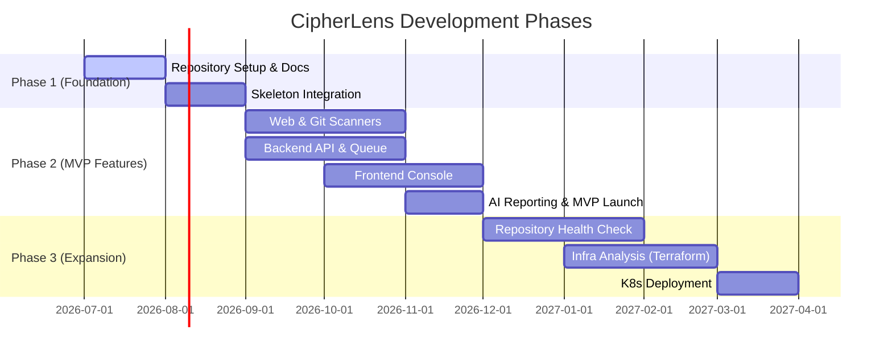

# CipherLens Project Roadmap

This roadmap lists milestones, target dates, and feature categories. Every feature starts as documentation before implementation.

---

## Roadmap Overview

---

## Phases & Deliverables

### Phase 1: Foundation & Setup (Current Phase)
* **Status:** Complete ✅
* **Deliverables:**
  * [x] Project Documentation System (`docs/`)
  * [x] AI Knowledge Base (`AGENTS.md`, `GEMINI.md`, `CLAUDE.md`)
  * [x] Core Architecture Decision Records (ADRs 001 - 005)
  * [x] Dockerized Local Development Infrastructure (PostgreSQL, Redis)
  * [x] Frontend React/Vite/Tailwind skeleton Setup
  * [x] Backend NestJS/Prisma skeleton Setup
  * [x] Scanner Python/Pydantic structure Setup
  * [x] Design System Tokens & Components Library
  * [x] V2 Product Identity Rebuild (Enterprise Landing Page)

### Phase 2: MVP Implementation (Planned)
* **Target:** Sep 2026 - Nov 2026
* **Deliverables:**
  * **Website Scan Module:** Security headers analyzer, TLS/SSL scanner.
  * **Git Scanner Module:** Git repository scanning for exposed API keys, secret tokens, and vulnerable package dependencies.
  * **Queue Orchestration:** Async scanning processing using BullMQ.
  * **Dashboard:** Project configuration, target configuration, scan history console.
  * **AI Report Generation:** LLM prompting backend to explain security findings and output printable/exportable PDF audit logs.

### Phase 3: Enterprise Expansion (Future)
* **Target:** Dec 2026+
* **Deliverables:**
  * Git Provider OAuth Integrations (GitHub Apps, GitLab Webhooks).
  * Infrastructure-as-Code (IaC) Auditing: Scan Terraform, CloudFormation, and Dockerfiles for misconfigurations.
  * Kubernetes Helm Chart packages for zero-trust private cluster deployments.
  * Schedule-based recurring scans with Slack/email alerting systems.
